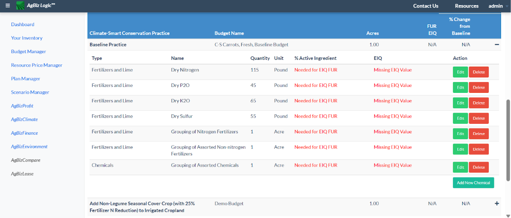

# Senior Capstone - AgBiz Logic

**Project Type:** Team project under NDA with industry partner via Oregon State University  
**Role:** Frontend Developer (AngularJS)

## Description
Contributed to an ongoing project with [AgBiz Logic](https://www.agbizlogic.com/), a platform for helping agricultural businesses make data-driven decisions. 
Our team focused on integrating [Environmental Impact Quotient (EIQ)](https://cals.cornell.edu/integrated-pest-management/risk-assessment/eiq) values to help users evaluate pesticide risks. 
- Integrated EIQ calculations
- Contributed to building an interactive EIQ value breakdowns for the chemicals in the user's plan

## Feature Highlight
Below is a screenshot of the tool showing an expanded dropdown table:

> The dropdown shows grouped chemical inputs for a practice.
> The **Edit** button opens a modal to adjust chemical parameters.
> Red indicator notify users when key data for a chemical is missing in their plan.

**Note:** Source code is under NDA and not publicly available.
